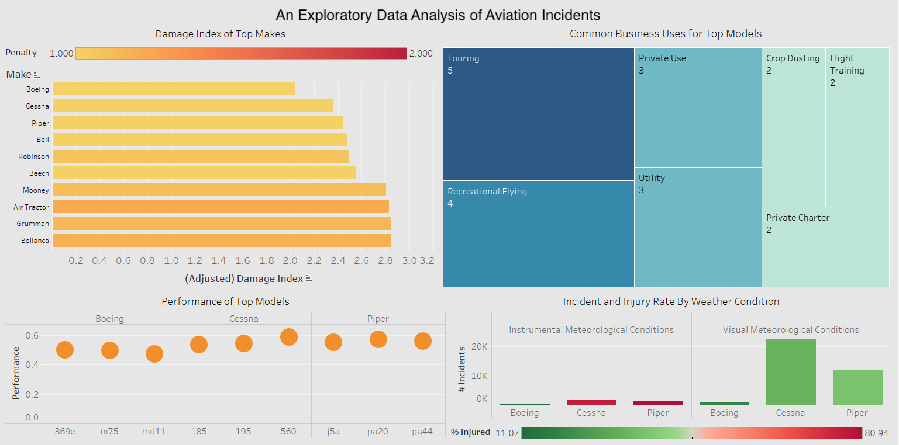
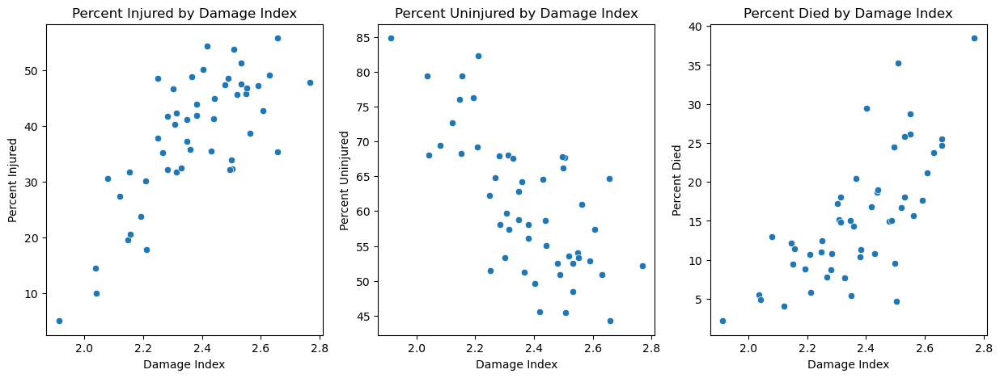
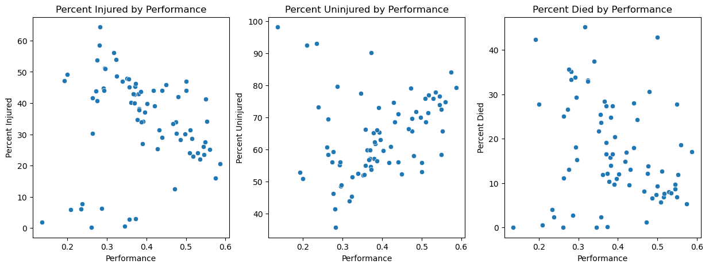
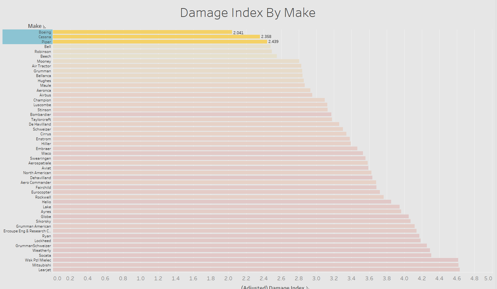
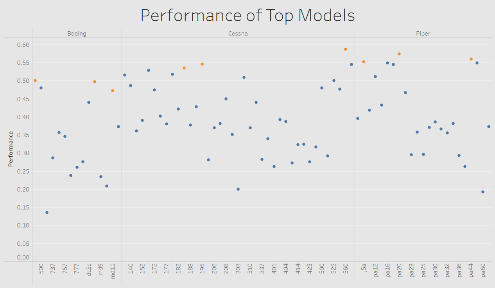
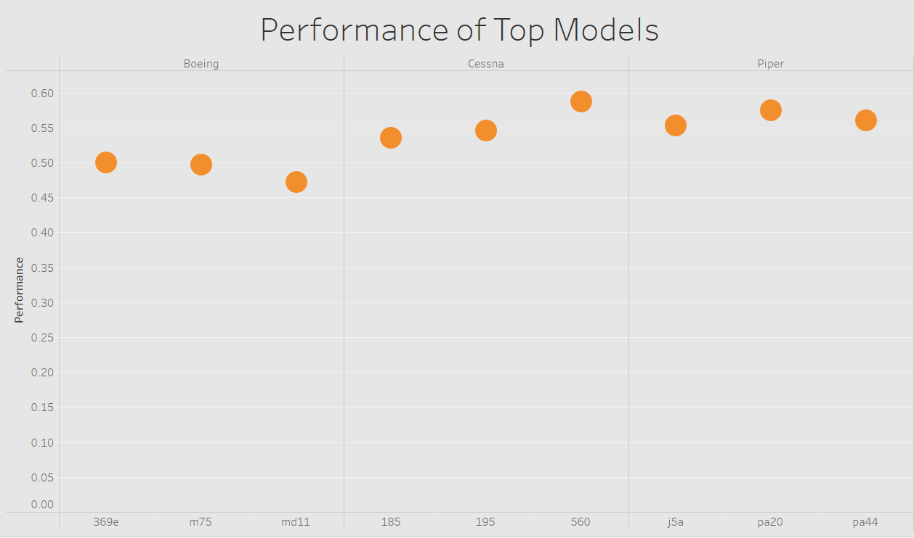
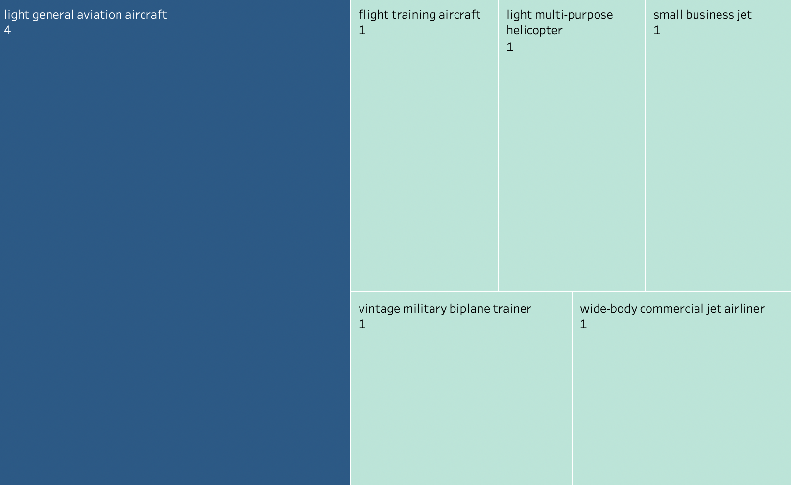
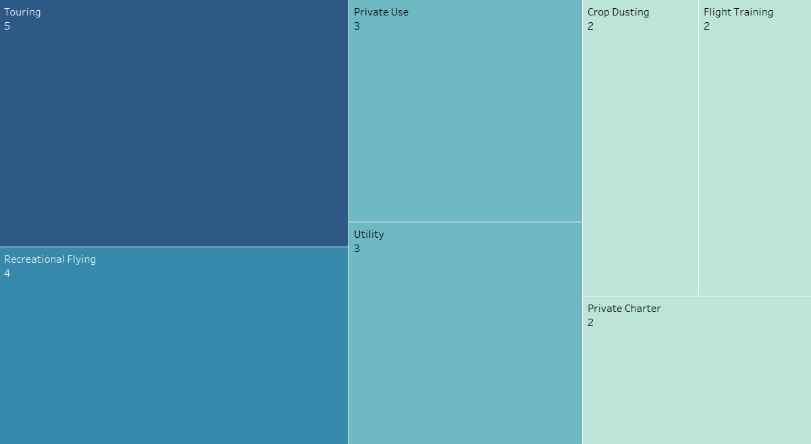
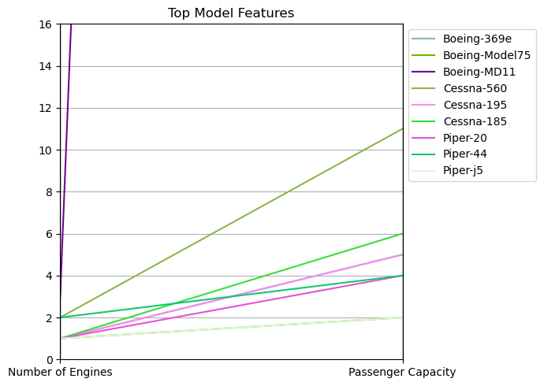
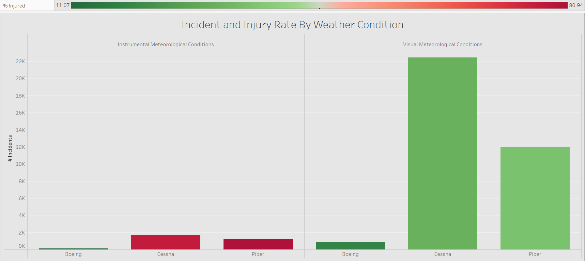

  <h1>An Exploratory Data Analysis of Aircraft Incidents</h1>

  

  <a href="https://public.tableau.com/app/profile/eduardo.gonzalez4245/viz/Book1-TO-EG/DataAnalysisOnAviationIncidentsDashboard" target="_blank" rel="noopener noreferrer">Visit Interactive Dashboard</a>

## The Business Problem

As we expand our business into new industries to diversify our portfolio, we encounter a few challenges that prevent us from moving forward. Specifically, we are considering a potential move into the aviation sector, aiming to establish a dedicated division for planes and helicopters. Unfortunately, we lack key knowledge on the risk factors involved in this industry and need to perform an exploratory analysis to detemine how to best proceed. 

Our company stands firm on a foundational principle: the most effective way to profit is by preserving our capital. Therefore, by minimizing the risks associated with the aircraft industry, we can rest assured that this new wing of our portfolio will meet the expectations of the investment.

Our primary objective is to determine which aircraft Makes and Models are the safest. We define a "safe" aircraft in two ways. First, one that was not involved in many incidents resulting in severe damage to the plane or helicopter. Second, an aircraft that has positive outcomes for passengers even when it is involved in unfortunate incidents. 

Once we have identified the safest aircrafts, we will explore their best use cases: what they were designed for and what they specialize in. With that information at hand, we can establish a clear business plan within our parameters.

Lastly, we will explore whether there are certain times or certain weather conditions that are safest for flying. Minimizing risk might imply creating a seasonal business. If that’s the case, when should we fly?

Here, we conduct three sets of analyses using [data](https://www.ntsb.gov/Pages/AviationQueryV2.aspx) collected by the [National Transportation Safety Board (NTSB)](https://www.usa.gov/agencies/national-transportation-safety-board). The dataset includes information about aircraft accidents from 1962 to 2023 in the United States and international waters.

## The Dataset
The data used for this research is from a dataset from the National Transportation Safety Board. This dataset includes aviation accident data from 1962 to 2023 about selected incidents in the United States and across international waters.
The dataset comes in the CSV format, and has 90348 Rows and 31 columns, only one of which showed no null values, with 609971 cells being NaNs in total, which is around 21% of the total dataset.
  
  
## Methods
This project involved cleaning the datasets to discover valuable insights into which aircraft models are the safest. We started by standardizing the names of makes and models, then filling or dropping nulls based on the need of that specific cell. We were then able to establish survival and injury rates for each incident.

Afterwards, we created two different algorithms to determine which make performs better overall. A “Damage Index” assigns a score to each incident and its intensity, adjusted by the amount of incidents overall per each make. Second, a set of established filters will evaluate the performance of the plane in each incident, based on the aforementioned survival and injury rates.

Our company is specifically interested in airplanes and helicopters. Below, we examine the values present in the Aircraft Category column to ensure our dataset is comprised of incidents from airplanes and helicopters.

When we exclude NaN values, we see that 85% of the dataset are airplanes and 10% are helicopters. This is a favorable result, as we are only interested in assessing incidents from airplanes and helicopters.

The dataset includes several other aircraft types (gliders, balloons, etc), which we will remove to exclude from our analysis.

There are also over 56k aircrafts with an unmarked aircraft category type. Since 90% of the known dataset comes from airplanes and helicopters, we expect that the vast majority of unknown aircraft types will also be from airplanes and helicopters.

We will use engine numbers and engine type to determine which aircrafts are likely airplanes or helicopters and which aircrafts are unlikely to be airplanes or helicopters and should be excluded from our analyses.

## Damage Index
Each row in the dataset contains information about an aircraft accident. In this section, we calculate a damage index to quantify how destructive the accidents were for a particular make of aircraft. The damage index considers the ratio of planes of a particular make that were destroyed in the incident, compared to the ratio of planes that with substantial damage and minor damage. 

We assume an exponential relationship between levels of aircraft damage, such that incidents with substantial damage are twice as bad as those with minor damage, but incidents with destroyed planes are four times as bad as those with minor damage. 

The damage index formula is as follows: (ratio destroyed x 4) + (ratio subtantial x 2) + (ratio minor x 1).

To validate that the damage index captures meaningful information, we will plot each make's damage index against key metrics (percent of passengers injured, percent of passengers uninjured, and percent of passengers who died). If the index captures meaningful information, we would expect to see positive, negative, and positive correlations, respectively. 

As expected, the above plots show a positive correlation between damage index and percent of passengers injured, a negative correlation between damage index and percent of passengers uninjured, and a positive correlation between damage index and percent of passengers who died. This indicates that the damage index is a useful measure when determining an aircraft's risks and safety.

## Model Performance
Each of our top three makes have low damage indices, however, the question still remains: when an aircraft is involved in an incident that results in damage, do the passengers leave the incident uninjured?

Now that we have identified the top three makes, we will further narrow down our list of aircrafts by selecting the models that have the highest performance, as defined by the ratio of incidents where passengers had positive outcomes. 

For planes that had substantial damage or were destroyed, performance was marked as positive if there were no fatalities. For planes that had minor damage, performance was marked as positive if there were no fatalities or injuries.

An overall performance score is generated by calculating the fraction of incidents that met the positive performance criteria over the total number of incidents for each model.

To validate that the performance metric captures meaningful information, we will plot each model's performance against key metrics (percent of passengers injured, percent of passengers uninjured, and percent of passengers who died). If the performance metric captures meaningful information, we would expect to see positive, negative, and positive correlations, respectively.

As expected, the above plots show a positive correlation between performance and percent of passengers injured, a negative correlation between performance and percent of passengers uninjured, and a positive correlation between performance and percent of passengers who died. This indicates that the performance metric is a useful measure when determining an aircraft's risks and safety. 

Next, we identify the three models with the best performance score for each of the top three makes, resulting in a total of nine top models (three from Boeing, three from Cessna, and three from Piper). 

## Results
Per the Damage Index, the top makes are: Boeing, Cessna, and Piper. 

Boeing, Cessna, and Piper are the companies and brands that are the least likely to be involved in an incident in which the aircraft is destroyed or suffers substantial damage. However, this doesn’t mean that they are the safest overall in the event of an incident. For this reason, we defer to the second algorithm, the performance model. 

Using the performance model, we can conclude that out of the three top makes we identified, the top performing models are:

Boeing: 369e, m75 and md11.

Cessna: 185, 195 and 560.

Piper: j5a, pa20 and pa44.

With a greater % of our passengers safe and uninjured, we can make sure that even in those accidents in which the aircraft suffers great damage, we can minimize the potential human losses and financial penalties in the form of lawsuits.

## Commonalities

After identifying the top nine aircraft models, we followed-up with research to discover what the models have in common. Our research showed the majority of the models are light, general aviation airplanes. Below are two treeplots that show the distribution of aircraft types and the most popular uses for the top models. 

  <h3>Categorization of Top Models</h3>

  <h3>Common Uses of Top Models</h3>

The above plots show that the majority of the final nine models are light, general aviation airplanes. Of their common business uses, touring, recreational flying, private use, and utlity are the most frequently occurring. For this reason, we recommend building a business arm that involves light airplanes used for either private use, recreation flying generally, or touring specifically.

Next, we explored the number of engines each aircraft has and the passenger capacity of each aircraft. We plot this information on a parallel plot below to highlight their overlapping features. 

The parallel plot shows that most (4) of the top models have 1 engine, which is consistent with their designation as light aircrafts. As these are predominately smaller aircrafts, the passenger capacity is on the lower range, with most aircrafts having a capacity of 6 or fewer. Note that the Boeing MD11 has three engines, and a passenger capacity of 410, which notably surpasses that of the other aircrafts in our top nine list and is not fully visible on the displayed scale.   

Finally, we explore whether there are certain weather or times that are safest for flying. In the barplot below, we show the performance of our chosen models under varying meteorological conditions: Instrumental Meteorological Conditions (IMC) and Visual Meteorological Conditions (VMC). We color the bars based on the model's injury rate to evaluate whether there is an interaction between meteorological condition and the percentage of people injured. 

Given the results above, we determine that when the meteorological conditions are categorized as VMC, there tends to be a greater number of incidents compared to when the meteorological conditions are categorized as IMC.

We note that even though there may be more incidents during good visibility (during the daytime or when the weather is clear), these incidents result in a low number of injured passengers. Conversely, there are fewer incidents during poor visibility (during rain, cloudy sky or dark at night), however these incidents result in a high number of injured passengers.

Therefore, we recommend flying during visual meteorological conditions to avoid passenger injury. We also recommend giving pilots more rigorous training for flying during visual meteorological conditions to avoid the risk of being involved in an incident.

## Recommendations:
* We recommend that the new business division concentrate on airplanes tailored for general recreation, touring, or private use.
  
* Once a direction among these three is chosen, there are specific plane models to consider. For recreation, models such as the Cessna 195, Cessna 185, Piper PA-20, Piper PA-44, and Boeing 369E are viable options. If touring is the preferred focus, the Cessna 195, Piper PA-20, and Boeing Model 75 stand out. For private use, the Cessna 195, Piper PA-20, and Piper PA-44 are recommended.
  
* Following the selection of a plane, the business should then refine its model. For touring, the business can offer aerial sightseeing tours or charter services tailored for tourists. Under the recreational use category, possibilities include establishing a membership-based flight club, offering lessons for budding pilots, or renting out planes to airshow enthusiasts. For private use, services can range from providing personalized design options for private buyers, to offering exclusive flights, renting out aircrafts, and even offering aircraft maintenance services.

## Next Steps:

* Future analyses can assess data on all US flights spanning from 1962 to 2023 to gauge performance during incident-free flights.
  
* Future analyses can also explore whether the number of engines, phase of the flight and location of the flight influences the flight's safety.
  
* To assess financial viability, it would additionally be beneficial to conduct a profit/loss analysis of the selected business model. 

## Repository Structure
├── imgs                   

├── .gitignore              

├── EDA-Aviation-Incidents.pdf

├── EDA-Aviation-Incidents.ipynb

└── README.md

